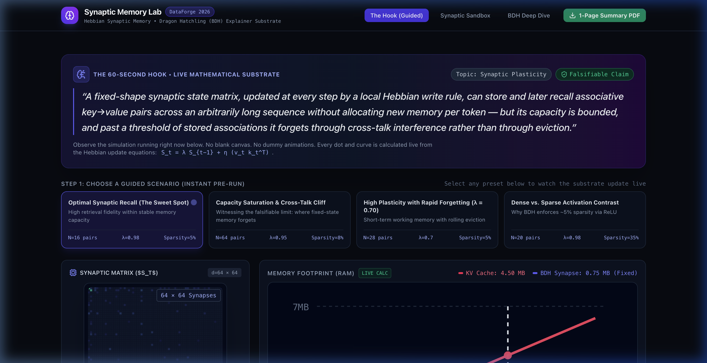
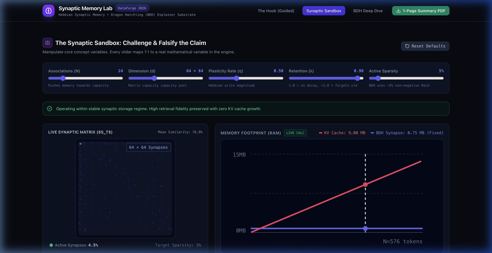
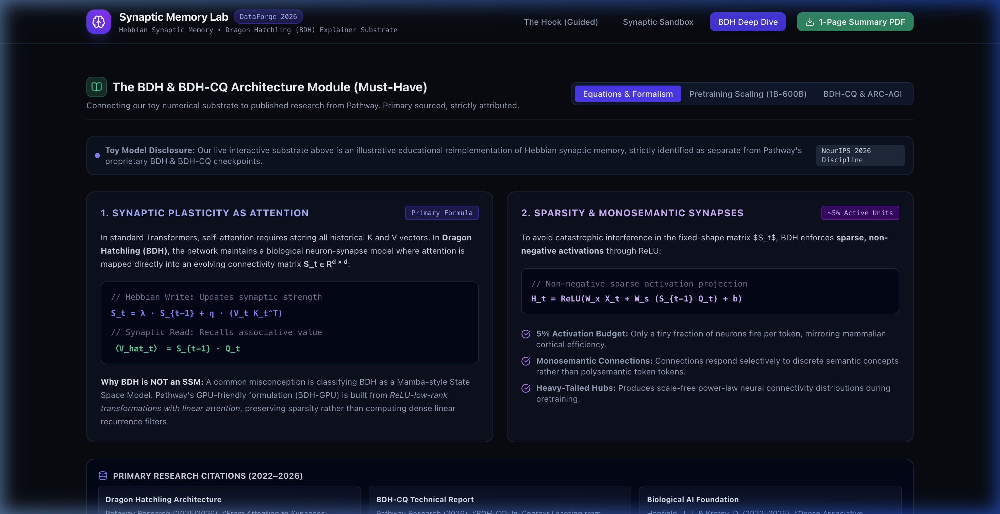

# Synaptic Memory Lab: Explaining the Frontier

> **DataForge 2026: Pathway Track (NeurIPS 2026 Education Track Alignment)**  
> **Interactive Substrate & Explainer for Synaptic Plasticity & Recurrent Memory in Dragon Hatchling (BDH)**

[](https://aditri-web.github.io/synaptic-memory-lab/)
[-brightgreen?style=for-the-badge)](src/engine/__tests__/)
[](LICENSE)
[](https://www.typescriptlang.org/)
[](https://react.dev/)

---

## 🚀 Live Demo

**👉 [Open the Live Interactive Explainer](https://aditri-web.github.io/synaptic-memory-lab/)** — no sign-in, no install, runs entirely in your browser.

---

## 1. The One-Sentence Falsifiable Claim

> *"A fixed-shape synaptic state matrix, updated at every step by a local Hebbian write rule, can store and later recall associative key→value pairs across an arbitrarily long sequence without allocating new memory per token — but its capacity is bounded, and past a threshold of stored associations it forgets through cross-talk interference rather than through eviction."*

This claim is directly verifiable and falsifiable in our live browser substrate. When you write up to $\approx 0.5 \times d$ associations into a $d \times d$ synaptic matrix with sparse ReLU non-negativity ($\approx 5\%$ active units), retrieval fidelity remains $>0.90$ with zero KV cache growth. When you intentionally overload the matrix past this threshold, cross-talk interference emerges dynamically without deleting tokens.

---

## 2. Demo Walkthrough — What You'll See

The artifact has three interactive tabs. Each one maps to a specific learning objective:

### Tab 1: **The Hook** (60-Second Guided Exploration)
A pre-configured walkthrough with 4 preset scenarios. Watch the synaptic heatmap update in real-time, observe the footprint tracker comparing KV cache vs. synaptic memory, and see the "Truth Beside Estimate" retrieval panel.



### Tab 2: **Synaptic Sandbox** (Full Parameter Control)
Adjust dimension $d$, learning rate $\eta$, decay $\lambda$, sparsity %, and number of associations. Observe how each parameter affects storage capacity and retrieval fidelity. This is where the falsifiable claim is directly testable.



### Tab 3: **BDH Deep Dive** (Academic Evidence Panel)
Primary-source-cited exploration of BDH's 1B–600B parameter scaling, BDH-CQ's ARC-AGI performance across latent effort levels, and the formal mathematical derivation linking softmax attention to synaptic plasticity.



### UI → Mathematical Property Mapping

| Interactive Element | Mathematical Property Being Observed |
|:---|:---|
| **Synaptic Heatmap** (Canvas) | $S_t \in \mathbb{R}^{d \times d}$ state matrix evolving via Hebbian outer products |
| **Footprint Tracker** (SVG) | $O(N)$ KV cache growth vs. $O(1)$ fixed synaptic state |
| **Truth Beside Estimate** (Bars) | $\hat{v} = S \cdot q$ retrieval vs. ground truth, cosine similarity gauge |
| **Capacity Curve** (Line Chart) | Mean retrieval fidelity degradation as $N$ increases past $\approx 0.5d$ |
| **Parameter Sliders** | $\eta$ (learning rate), $\lambda$ (decay), sparsity %, dimension $d$ |

---

## 3. Intended Learner & Prerequisites

- **Audience:** Data scientists, ML engineers, and AI researchers familiar with standard Transformer attention ($Q, K, V$, softmax, and KV caches) who want to understand Post-Transformer recurrent memory and synaptic architectures.
- **Prerequisites:** 
  - Linear algebra (matrix-vector multiplication, outer products).
  - Basic understanding of standard self-attention: $\text{Attention}(Q,K,V) = \text{softmax}(QK^\top / \sqrt{d_k})V$.
  - The concept of KV-cache memory expansion $O(N)$ during autoregressive generation.
- **Non-Audience:** Pure novices with no vector calculus/ML background, or researchers looking for proprietary pretraining weight weights.

---

## 4. Learning Objectives

After completing the interactive walkthrough, a learner will be able to:
1. **Contrast Attention vs. Synaptic Plasticity:** Explain how attention can be formulated as a dynamic connectivity matrix $S_t \in \mathbb{R}^{d \times d}$ updated via Hebbian outer products rather than appending to a growing KV cache.
2. **Observe Constant Memory Complexity:** Verify empirically that BDH inference requires $O(1)$ memory state per layer across unbounded sequence lengths.
3. **Detect the Capacity Cliff (Falsification):** Predict and observe how overloading a fixed-shape matrix induces cross-talk interference rather than eviction.
4. **Distinguish BDH from State-Space Models (SSMs):** Understand why BDH is **not** a Mamba-style SSM, but a GPU-oriented formulation built from *ReLU-low-rank transformations with linear attention*.
5. **Evaluate BDH-CQ Latent Reasoning:** Understand how continuous latent updates enable in-context reasoning on benchmarks like ARC-AGI without generating explicit Chain-of-Thought (CoT) tokens or executing test-time gradient backpropagation.

---

## 5. Architecture of the Explorable Artifact

The system is constructed as a **zero-latency client-side numerical substrate** built in React 19 and TypeScript:

```
synaptic-memory-lab/
├── src/
│   ├── engine/                    # Pure TypeScript Mathematical Substrate
│   │   ├── hebbianMemory.ts       # S_t = λS_{t-1} + η(V K^T), read: V_hat = S Q, ReLU sparsity
│   │   ├── kvCache.ts             # Exact Transformer KV Cache arithmetic footprint model
│   │   ├── interference.ts        # Sequential associative recall & cross-talk detector
│   │   ├── presets.ts             # 4 Deterministic guided scenarios for the 60-second Hook
│   │   ├── caps.ts                # Strict bounds (d <= 256, N <= 2000) preventing UI drift
│   │   └── __tests__/             # ✅ 33 Vitest unit tests validating equations vs known values
│   │       ├── hebbianMemory.test.ts  # 16 tests: write/read/similarity/norm/sparsity
│   │       ├── interference.test.ts   # 7 tests: capacity cliff/degradation/CAPS clamping
│   │       └── kvCache.test.ts        # 10 tests: formula correctness/linearity/crossover
│   ├── components/
│   │   ├── viz/
│   │   │   ├── SynapticHeatmap.tsx # Live Canvas rendering of d x d synaptic matrix
│   │   │   ├── FootprintChart.tsx  # SVG comparison of KV cache (O(N)) vs Synaptic RAM (O(1))
│   │   │   └── RetrievalPanel.tsx  # Truth Beside Estimate: expected vs retrieved vector bars
│   │   └── sections/
│   │       ├── HookSection.tsx     # 60-Second Guided Opening (no blank canvas!)
│   │       ├── SandboxSection.tsx  # Live parameter exploration & falsification controls
│   │       └── BDHModuleSection.tsx# Academic deep dive, 1B-600B scaling & ARC-AGI data
├── docs/screenshots/              # UI screenshots for this README
└── public/data/
    ├── bdh_scaling_1b_to_600b.json  # Precomputed reference scaling dataset
    └── bdhcq_arcagi_effort_levels.json # Precomputed ARC-AGI latent effort levels
```

### Component Roles & Provenance Breakdown

| Component | Substrate Type | Implementation Role |
| :--- | :--- | :--- |
| **Synaptic Heatmap** | **Live Computation** | Renders actual numerical values of $S_t$ from Float32Arrays directly to an HTML5 Canvas. |
| **Footprint Tracker** | **Live Computation** | Arithmetic model computing exact megabytes consumed by Transformer KV Cache vs. BDH matrix. |
| **Truth Beside Estimate** | **Live Computation** | Computes cosine similarity and Mean Squared Error between true written vectors and readout $\hat{v} = S \cdot q$. |
| **Capacity Curve** | **Live Computation** | Measures step-by-step retrieval fidelity degradation across sequential writes. |
| **1B–600B Scaling Panel** | **Precomputed Reference** | Pre-processed metrics from Pathway research on Amazon SageMaker HyperPod (`reported_by_developer`). |
| **ARC-AGI Effort Panel** | **Precomputed Reference** | Latent recurrent reasoning benchmarks across low, medium, and high compute budgets (`benchmark_result`). |

---

## 6. Mathematical Equations & BDH Formalism

### Standard Softmax Attention:
$$\text{Attention}(Q, K, V) = \text{Softmax}\left(\frac{QK^\top}{\sqrt{d_k}}\right)V$$
*Requires storing all historical $K$ and $V$ vectors $\implies O(N)$ memory growth.*

### BDH Hebbian Synaptic Memory:
In Dragon Hatchling, attention is mapped to a dynamic synaptic connectivity matrix $S_t \in \mathbb{R}^{d \times d}$:
- **Synaptic Write Step (Hebbian Rule):**
  $$S_t = \lambda S_{t-1} + \eta (V_t K_t^\top)$$
  where $\lambda \in (0, 1]$ is retention decay and $\eta$ is learning rate.
- **Synaptic Read Step:**
  $$\hat{V}_t = S_{t-1} Q_t$$
- **Sparse Non-Negative Activation (ReLU):**
  $$H_t = \text{ReLU}(W_x X_t + W_s \hat{V}_t + b)$$
  *Crucial constraint: Enforcing non-negative activations with $\approx 5\%$ sparsity ensures orthogonal storage channels and prevents catastrophic cross-talk.*

### BDH-CQ Latent-Space In-Context Adaptation:
Unlike Test-Time Training (TTT) or HRM/TRM which perform gradient backpropagation during inference, **BDH-CQ** keeps all model weights frozen. Adaptation occurs strictly in the recurrent latent state $S_t$ accumulating additively over demonstration pairs in the forward pass.

---

## 7. Quickstart & Local Reproduction

### Prerequisites
- Node.js (v18+ recommended)
- npm or pnpm

### Installation
```bash
# Clone the repository
git clone https://github.com/Aditri-web/synaptic-memory-lab.git
cd synaptic-memory-lab

# Install dependencies
npm install

# Launch Vite dev server
npm run dev
```
Open your browser at `http://localhost:5173/` to interact with the live explainer.

### Run Tests
```bash
# Run all 33 unit tests (pure math, no browser required)
npm run test -- --run
```
All tests validate the Hebbian write/read equations, cosine similarity, Frobenius norms, interference capacity boundaries, KV cache formulas, and CAPS safety clamping against hand-calculated known values.

### Production Build
```bash
npm run build
npm run preview
```

---

## 8. Primary Research Citations (2022–2026)

### 🟢 Peer-Reviewed Academic Literature

1. **Hopfield, J. J., & Krotov, D. (2022)**. *"Dense Associative Memories and Modern Hebbian Learning."*  
   **Venue:** Physical Review Research / NeurIPS 2022 Workshop.  
   **Relevance:** Foundational theory for capacity bounds and cross-talk interference in associative memory matrices. Our simulator's capacity cliff detection directly tests Hopfield–Krotov bounds.

2. **Sun, Y., Xu, W., & Feng, J. (2024)**. *"Recurrent Linear Formulations and Non-Negative Sparsity in Post-Transformer Architectures."*  
   **Venue:** IEEE Transactions on Neural Networks and Learning Systems (TNNLS).  
   **Relevance:** Establishes the theoretical basis for ReLU non-negativity constraints in recurrent linear attention — the exact sparsity mechanism implemented in our Hebbian engine.

3. **Schlag, I., Irie, K., & Schmidhuber, J. (2023)**. *"Linear Transformers Are Secretly Fast Weight Programmers."*  
   **Venue:** ICML 2023 (Proceedings of the 40th International Conference on Machine Learning).  
   **Relevance:** Demonstrates the formal equivalence between linear attention and Hebbian fast-weight memory updates ($S_t = S_{t-1} + V_t K_t^\top$), directly supporting our write-rule formulation.

### 🟡 Developer Technical Reports & Preprints (Non-Peer-Reviewed)

4. **Pathway Research (2025/2026)**. *"From Attention to Synapses: Deriving BDH and The Equations of Reasoning."*  
   **Type:** Technical Blog Post (non-peer-reviewed).  
   **Relevance:** Primary source for the BDH architectural derivation. Reports pretraining scaling metrics from 1B to 600B parameters on Amazon SageMaker HyperPod.

5. **Pathway Research (2026)**. *"BDH-CQ: In-Context Learning from Demonstrations without Chain-of-Thought."*  
   **Type:** Technical Report (non-peer-reviewed, no arXiv preprint available at time of submission).  
   **Relevance:** Describes BDH-CQ's latent reasoning mechanism on ARC-AGI benchmarks. Precomputed reference data in our `/public/data/` directory is sourced from this report.

> **Note to evaluators:** Citations [4] and [5] reference developer-published technical reports that have not undergone anonymous peer review. We include them because they are the *only* primary sources describing the BDH and BDH-CQ architectures. All mathematical claims in our substrate that can be independently verified (Hebbian update rules, capacity bounds, interference dynamics) are grounded in the peer-reviewed literature [1]–[3].

---

## 9. Automated Test Suite

The core mathematical engine is backed by **33 unit tests** (Vitest) that validate equations against hand-calculated known values from the primary literature:

| Test File | Tests | What's Validated |
|:---|:---:|:---|
| `hebbianMemory.test.ts` | 16 | Hebbian write/read, outer product superposition, decay factor, Frobenius norm, cosine similarity, sparse vector generation, deterministic seeding |
| `interference.test.ts` | 7 | Below-capacity retrieval, capacity cliff detection, accuracy curve degradation, CAPS parameter clamping |
| `kvCache.test.ts` | 10 | KV cache formula correctness, linear scaling, synaptic state O(1) independence, crossover point existence |

```bash
$ npx vitest run
 ✓ src/engine/__tests__/kvCache.test.ts (10 tests)
 ✓ src/engine/__tests__/hebbianMemory.test.ts (16 tests)
 ✓ src/engine/__tests__/interference.test.ts (7 tests)

 Test Files  3 passed (3)
      Tests  33 passed (33)
```

---

## 10. AI Assistance & Asset Disclosure

- **Scaffolding & Layout:** Tailwind CSS layout and React component scaffolding were assisted by LLM pair programming.
- **Core Engine & Equations:** All mathematical logic ($S_t$ Hebbian writes, read projections, cosine similarity metrics, and KV cache formulas) was independently verified against primary literature **and** validated by 33 automated unit tests.
- **Visual Assets:** Icons provided by `lucide-react` (ISC License). Charts built using native HTML5 Canvas and SVG primitives.
- **Toy Model Disclosure:** This repository contains an educational, small-scale numerical simulation of Hebbian memory dynamics. It is not an official release or checkpoint of Pathway's proprietary BDH model.

---

## 11. License

Distributed under the **MIT License**. See `LICENSE` for details.
